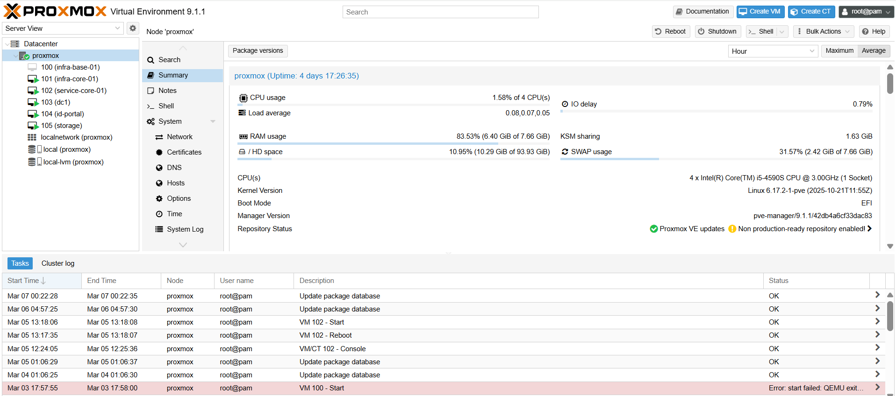
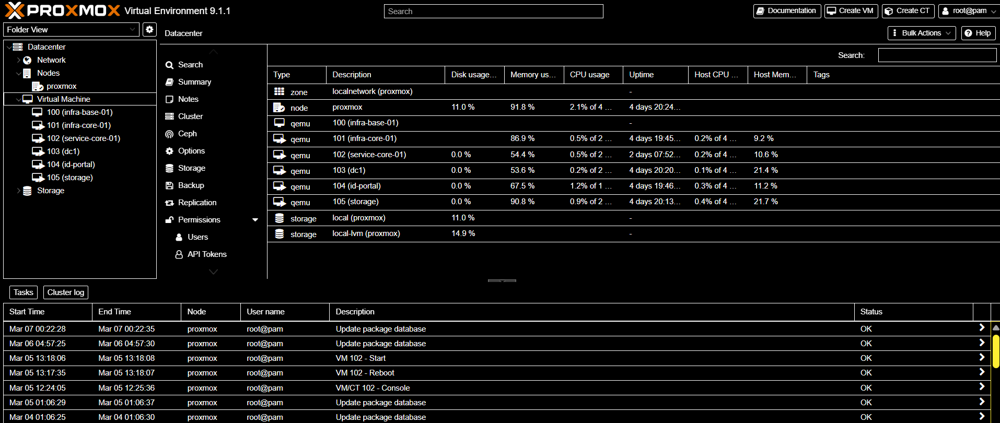
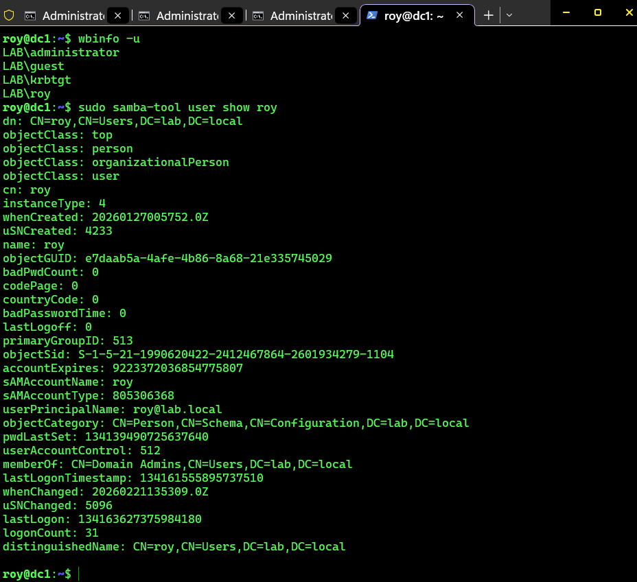
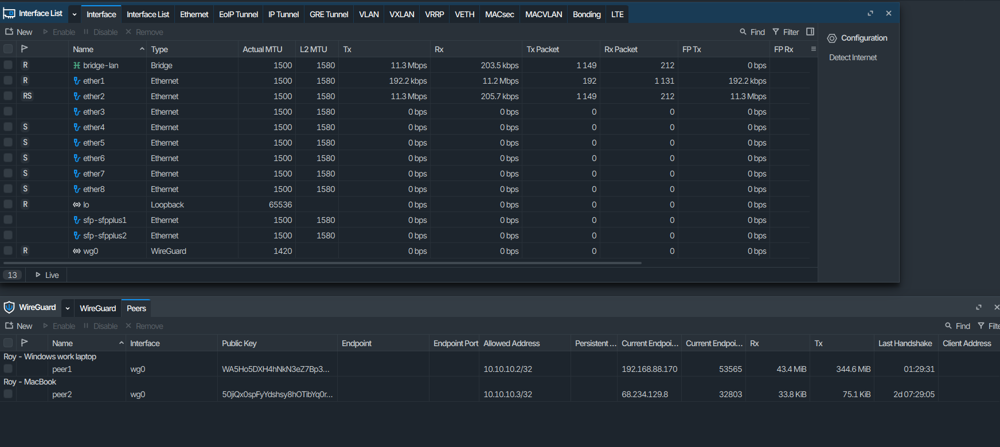
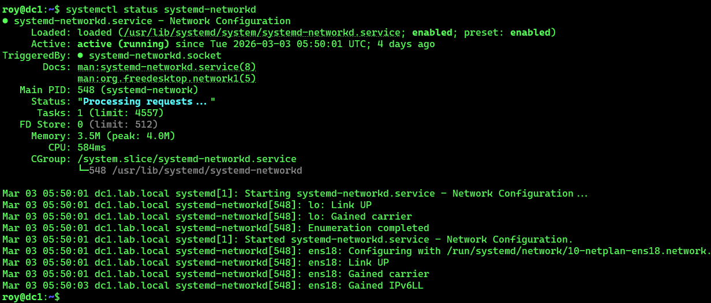
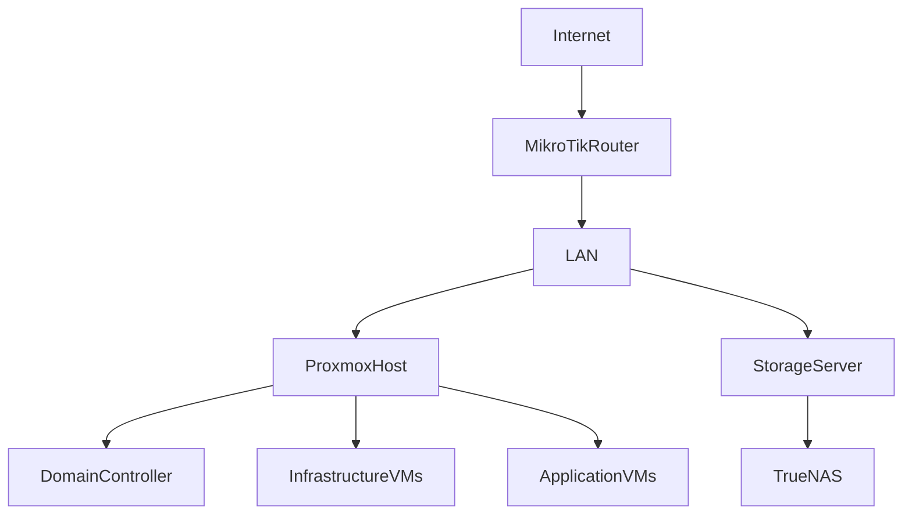
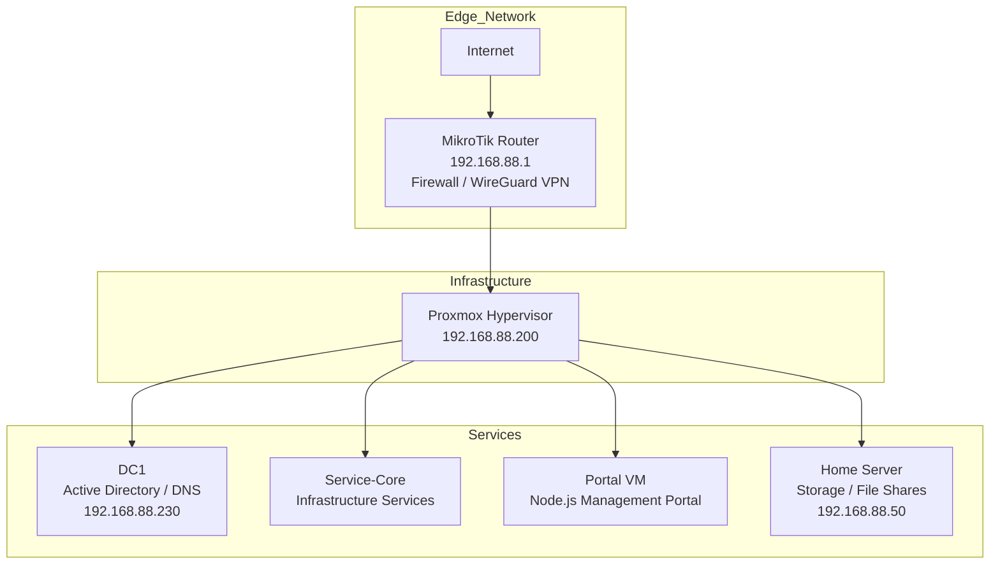

# WEP Global Tech Home Lab

## Navigation

- [Architecture](#architecture)
- [Infrastructure Inventory](#infrastructure-inventory)
- [Infrastructure Screenshots](#infrastructure-screenshots)
- [Technology Stack](#technology-stack)
- [Project Goals](#project-goals)
- [Future Roadmap](#future-roadmap)

This repository documents my enterprise-style home lab used to simulate real-world IT infrastructure environments.

The lab is designed to practice systems administration, networking, virtualization, and automation using technologies commonly found in production environments.

---

# Infrastructure Overview

The environment is built using a layered architecture consisting of networking, virtualization infrastructure, and application services.

Secure remote access is provided through a WireGuard VPN connected to a MikroTik firewall.

Core infrastructure services include Proxmox virtualization, Active Directory domain services, and TrueNAS storage.

---
# Infrastructure Screenshots

## Proxmox Virtualization Host

---

## Virtual Machine Inventory

---

## Active Directory Domain

---

## Network Infrastructure

---

## Linux Server Monitoring / Glances

# Architecture

---

## Architecture Overview

The lab is structured using a three-tier infrastructure model:

- **Edge Layer** – MikroTik router providing firewall protection and WireGuard VPN access.
- **Infrastructure Layer** – Proxmox hypervisor hosting all virtual machines.
- **Services Layer** – Domain services, application services, monitoring tools, and storage.

# Infrastructure Inventory

| System | Role | Operating System | IP Address |
|------|------|------|------|
| Proxmox Host | Virtualization Hypervisor | Debian / Proxmox VE | 192.168.88.200 |
| DC1 | Active Directory Domain Controller | Ubuntu Server + Samba AD | 192.168.88.230 |
| service-core | Application / Services Server | Ubuntu Server | 192.168.88.xxx |
| Portal | Infrastructure Management Portal | Node.js / Linux | 192.168.88.xxx |
| Home Server | Storage / File Server | Windows 11 | 192.168.88.50 |
| MikroTik Router | Firewall / Routing / VPN | RouterOS | 192.168.88.1 |
# Technology Stack
## Networking

- MikroTik RouterOS

- WireGuard VPN

- VLAN segmentation

## Virtualization

- Proxmox VE

- Linux Virtual Machines

## Identity

- Active Directory Domain Services

- Internal DNS

## Storage

- TrueNAS

- Network File Shares

## Applications

- Node.js infrastructure tools

- Internal management portal

- Monitoring utilities

  ---

# Skills Demonstrated

This home lab demonstrates hands-on experience with enterprise infrastructure technologies and operational practices.

### Infrastructure

- Virtualization using Proxmox
- Multi-server infrastructure design
- Virtual machine lifecycle management

### Networking

- Router configuration using MikroTik RouterOS
- Firewall rule management
- Secure remote access using WireGuard VPN
- Private LAN architecture (192.168.88.0/24)

### Identity & Access Management

- Active Directory domain services
- Domain user and group management
- Centralized authentication

### Linux Server Administration

- Ubuntu Server deployment
- Service management using systemd
- System monitoring with Glances

### Storage

- Network storage management
- File share services
- Infrastructure data management

### Infrastructure Monitoring

- System performance monitoring
- Resource usage tracking
- Server health visibility

  ---

# Lab Design Principles

The WEP Global Tech Home Lab is designed using several core infrastructure principles commonly used in enterprise environments.

### Security

- Network boundary protection using MikroTik firewall rules
- Secure remote access through WireGuard VPN
- Controlled access to internal services

### Segmentation

- Separation between edge networking, infrastructure systems, and application services
- Logical organization of virtual machines within the Proxmox environment

### Centralized Identity

- Active Directory provides centralized authentication and directory services
- Domain-based management of users and systems

### Virtualization

- Proxmox hypervisor hosts all infrastructure services
- Virtual machines allow isolation and simplified lifecycle management

### Observability

- System monitoring using Glances
- Visibility into CPU, memory, disk, and network activity

### Scalability

- The environment is structured to allow easy addition of new virtual machines and services
- Modular architecture allows expansion without redesigning the core infrastructure

## Project Goals

-  Build hands-on enterprise infrastructure experience
-  Practice network design and segmentation
-  Develop infrastructure automation tools
-  Document real-world troubleshooting scenarios

## Future Roadmap

- Centralized monitoring

- Infrastructure automation

- Containerized services

- Internal helpdesk system

- Advanced network segmentation
