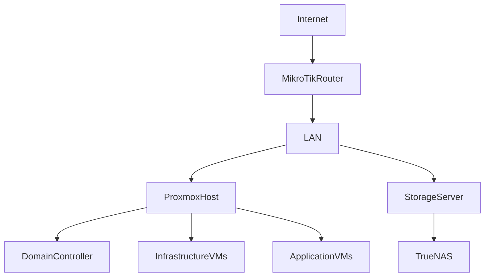

# WEP Global Tech Home Lab

This repository documents my enterprise-style home lab used to simulate real-world IT infrastructure environments.

The lab is designed to practice systems administration, networking, virtualization, and automation using technologies commonly found in production environments.

---

# Infrastructure Overview

The environment is built using a layered architecture consisting of networking, virtualization infrastructure, and application services.

Secure remote access is provided through a WireGuard VPN connected to a MikroTik firewall.

Core infrastructure services include Proxmox virtualization, Active Directory domain services, and TrueNAS storage.

---

# Architecture

# Technology Stack
## Networking

MikroTik RouterOS

WireGuard VPN

VLAN segmentation

## Virtualization

Proxmox VE

Linux Virtual Machines

## Identity

Active Directory Domain Services

Internal DNS

## Storage

TrueNAS

Network File Shares

## Applications

Node.js infrastructure tools

Internal management portal

Monitoring utilities

## Project Goals

• Build hands-on enterprise infrastructure experience
• Practice network design and segmentation
• Develop infrastructure automation tools
• Document real-world troubleshooting scenarios

## Future Roadmap

Centralized monitoring

Infrastructure automation

Containerized services

Internal helpdesk system

Advanced network segmentation